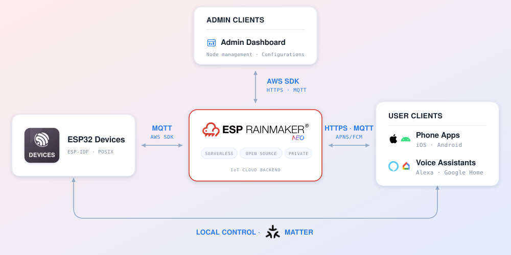

# ESP RainMaker Neo - IoT Cloud

**Tools**

[](https://espressif.github.io/esp-launchpad/?flashConfigURL=https://espressif.github.io/esp-rainmaker-neo-firmware/launchpad.toml)
&nbsp;
[](https://apps.apple.com/us/app/esp-rainmaker-home/id1563728960)
&nbsp;
[](https://play.google.com/store/apps/details?id=com.espressif.novahome)

**Documentation**

[](https://neo.rainmaker.espressif.com)
&nbsp;
[](https://docs.neo.rainmaker.espressif.com/)

---

## Introduction

ESP RainMaker Neo is a serverless, open-source IoT cloud for ESP devices that you deploy into your own AWS account. It scales with your fleet and is pay-as-you-go. Devices connect over MQTT through AWS IoT. Phone apps, the admin dashboard and voice assistants reach the same backend over REST APIs and MQTT.

<p align="center">
  
</p>

### Repositories

| Repository                                                                            | Holds                                            |
| ------------------------------------------------------------------------------------- | ------------------------------------------------ |
| [esp-rainmaker-neo](https://github.com/espressif/esp-rainmaker-neo)                   | Cloud backend, admin dashboard |
| [esp-rainmaker-neo-firmware](https://github.com/espressif/esp-rainmaker-neo-firmware) | Device firmware SDK                              |
| [esp-rainmaker-home](https://github.com/espressif/esp-rainmaker-home)<br>[esp-rainmaker-neo-app-sdk-ts](https://github.com/espressif/esp-rainmaker-neo-app-sdk-ts) | ESP RainMaker Home phone app (iOS and Android)<br>(this repository) ESP RainMaker Neo App SDK (TypeScript) |


---

# ESP RainMaker Neo TypeScript SDK

**RainMaker Neo** (short: **RMNeo**) is Espressif’s AIoT stack. `@espressif/rainmaker-neo-base-sdk` is the TypeScript SDK that powers JavaScript-based apps integrating with RainMaker Neo — authentication, groups/nodes, device provisioning, real-time MQTT control, and group sharing.

## Table of Contents

- [Key Features](#key-features)
- [Requirements](#requirements)
- [Installation](#installation)
  - [Local development](#local-development)
- [Quick Start](#quick-start)
- [Examples](#examples)
  - [Login and user info](#login-and-user-info)
  - [Connect MQTT and control a node](#connect-mqtt-and-control-a-node)
  - [Group-wide control](#group-wide-control)
  - [Create groups and share](#create-groups-and-share)
  - [Accept a sharing request](#accept-a-sharing-request)
  - [Provision a device](#provision-a-device)
- [API Documentation](#api-documentation)
- [Contributing](#contributing)
- [License](#license)

## Key Features

- [x] **AWS Cognito Authentication:** Secure user authentication with automatic session management and token refresh
- [x] **MQTT Real-time Communication:** Direct AWS IoT Core integration with automatic credential provisioning
- [x] **Device Provisioning:** Complete device setup workflow with WiFi provisioning and cloud binding
- [x] **Type Safety:** Full TypeScript support with comprehensive type definitions
- [x] **Modular Design:** Clean architecture with separate modules for authentication, device management, and communication
- [x] **Automatic Storage:** Seamless data persistence via app-supplied storage adapters
- [x] **Error Handling:** Comprehensive error handling with detailed logging

## Requirements

- **Node.js** 18+
- **TypeScript** 5+ (recommended)

## Installation

```bash
npm install @espressif/rainmaker-neo-base-sdk
# or
yarn add @espressif/rainmaker-neo-base-sdk
# or
pnpm add @espressif/rainmaker-neo-base-sdk
```

### Local development

```bash
npm install
npm run build
npm pack
# in your app:
npm install <PATH_TO_PACK_TARBALL_FILE>
```

## Quick Start

```typescript
import { ESPRMNeoBase } from "@espressif/rainmaker-neo-base-sdk";

ESPRMNeoBase.init({
  baseUrl: "https://your-api-gateway.amazonaws.com/prod",
  userApiBase: "https://your-user-api-gateway.amazonaws.com/prod",
  awsRegion: "us-east-1",
  iotEndpoint: "xxxxxxxx-ats.iot.us-east-1.amazonaws.com",
  // Optional adapters (provided by your app):
  // mqttAdapter, customStorageAdapter, provisionAdapter, ...
});

const auth = ESPRMNeoBase.getAuthInstance();
const user = await auth.login("user@example.com", "password");

await user.getTemporaryAWSCredentials();
const connected = await user.connectMQTT();
```

## Examples

### Login and user info

```typescript
import { ESPRMNeoBase } from "@espressif/rainmaker-neo-base-sdk";

const auth = ESPRMNeoBase.getAuthInstance();
const user = await auth.login("user@example.com", "password");

const info = await user.getUserInfo();
console.log(info);
```

### Connect MQTT and control a node

```typescript
await user.getTemporaryAWSCredentials();
await user.connectMQTT();

const groups = await user.getGroups();
const home = groups[0];
const node = await home.getNode("your-node-id");

// Device params
const light = node.devices.find((d) => d.name === "Light");
const power = light?.params.find((p) => p.id === "Power");
const brightness = light?.params.find((p) => p.id === "Brightness");

await power?.setValue(true);
await brightness?.setValue(80);

// Service params (e.g. Time)
const time = node.services.find((s) => s.name === "Time");
const tz = time?.params.find((p) => p.id === "TZ");
await tz?.setValue("Asia/Shanghai");
```

### Group-wide control

```typescript
// Broadcasts the same command to every node in the group
await home.setParams({
  Light: {
    Power: false,
  },
});
```

### Create groups and share

```typescript
// High-level group: location / site / home
const home = await user.createGroup("Home");

// Rooms as subgroups under the home
const livingRoom = await home.createSubGroup("Living Room");
const bedroom = await home.createSubGroup("Bedroom");

// Share the home (or a room subgroup) with another user
await home.share({
  userCode: "ABCD1234",
  accessType: "secondary",
});
```

### Accept a sharing request

```typescript
const requests = await user.listSharingRequests();

for (const request of requests) {
  await request.accept();
}
```

### Provision a device

```typescript
import { ESPDevice } from "@espressif/rainmaker-neo-base-sdk";

const device = new ESPDevice({
  name: "PROV_XXXXXX",
  transport: "ble",
  security: 1,
});

await device.connect();

const networks = await device.scanWifiList();
console.log(networks);

const nodeId = await device.provision(
  "HomeWiFi",
  "wifi-password",
  (progress) => console.log(progress.description),
  livingRoom.groupId // associate with a room subgroup
);

console.log("Provisioned node:", nodeId);
await device.disconnect();
```

## API Documentation

Browse the hosted API reference at [https://espressif.github.io/esp-rainmaker-neo-app-sdk-ts/](https://espressif.github.io/esp-rainmaker-neo-app-sdk-ts/).

To generate local docs from JSDoc:

```bash
npm run genDocs
```

Open `docs/index.html` in a browser. Docs are generated with [TypeDoc](https://typedoc.org/).

## Contributing

1. Fork the repository
2. Create a feature branch (`git checkout -b feature/amazing-feature`)
3. Commit and push your changes
4. Open a Pull Request

See [Changelog](CHANGELOG.md) for release notes.

## License

Apache 2.0 — see [LICENSE](LICENSE).
